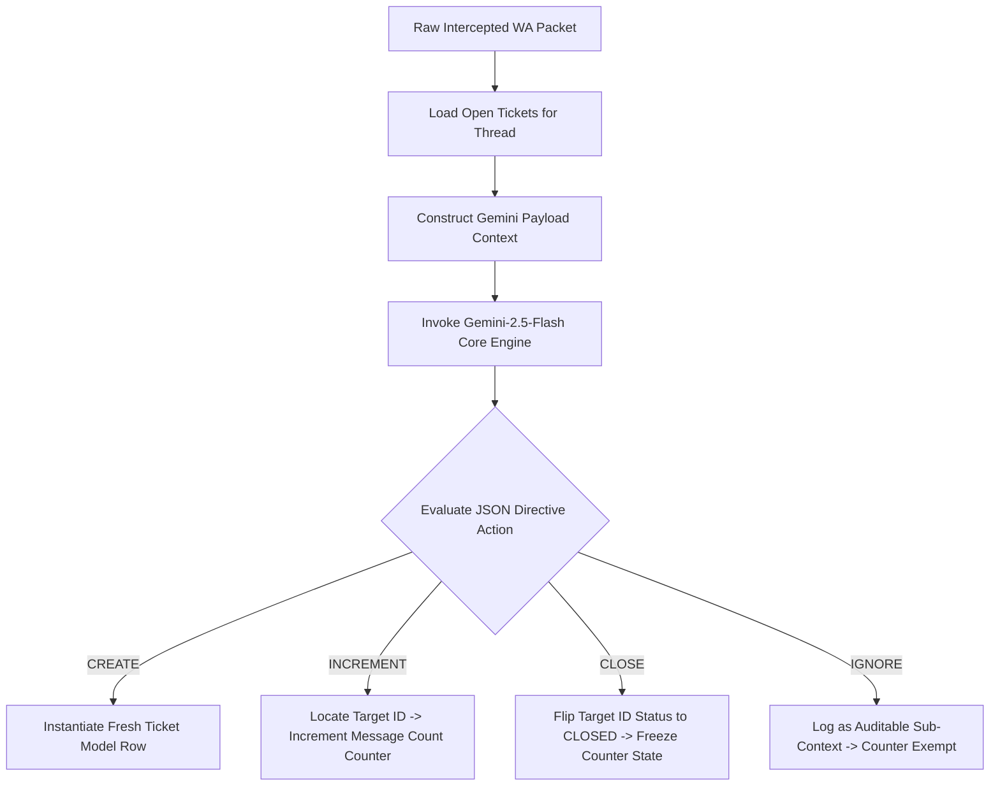

# Gemini Autonomous Complaints Monitoring and Tracking System

This blueprint details the complete transition from a rigid rule-based routing script to an **AI-Driven Workflow Controller Engine** using Google Gemini. By handing message telemetry and ticket histories to Gemini contextually, the model functions as an autonomous decision engine—opening cases, tracking counters per individual ticket, executing secure counter freezes upon attachment detection, and discarding non-essential chatter natively.

---

## 1. System Topology & Dynamic Intent Routing

Traditional regex filters suffer from format fragility, failing whenever institutional entities alter their message headers. This system employs a **Stateful AI Interceptor Pattern**. 

Every text fragment or attachment caption, regardless of sender, is packaged with the chat thread's history of active tickets and sent to Gemini. Gemini returns an structured operational directive detailing exactly which record to modify.



---

## 2. Dynamic Database Schema (`complaints_cache.json`)

To facilitate multiple concurrent tickets on the exact same telephone connection without cross-contamination, the schema stores structural data rows grouped cleanly by ticket identities:

```json
[
  {
    "ticketId": "MOH-541290",
    "senderPhone": "966505190413",
    "status": "OPEN",
    "messageCount": 4,
    "openDate": "2026-06-11T09:00:00.000Z",
    "closeDate": null
  },
  {
    "ticketId": "TEMP-966505190413-176589300",
    "senderPhone": "966505190413",
    "status": "CLOSED",
    "messageCount": 2,
    "openDate": "2026-06-10T14:22:11.000Z",
    "closeDate": "2026-06-11T11:45:00.000Z"
  }
]
```

---

## 3. The Gemini Decision Core Engine

This foundational block establishes the configuration mapping utilizing the official, modern `@google/genai` SDK package. It configures a structured semantic parser forcing strict JSON constraint adherence.

```javascript
const { GoogleGenAI } = require('@google/genai');

// Instantiates client layer utilizing standard environment setups (process.env.GEMINI_API_KEY)
const ai = new GoogleGenAI({});

/**
 * Passes runtime transaction context down to Gemini to retrieve atomic database update instructions.
 * @param {string} messageText - Cleaned content extracted from the packet frame.
 * @param {boolean} fromMe - Identity check flag (true = Clinic, false = MOH).
 * @param {boolean} hasAttachment - Payload contains file buffers.
 * @param {Array} activeTickets - Filtered array list showing currently open tickets for this sender.
 */
async function computeWorkflowDecision(messageText, fromMe, hasAttachment, activeTickets) {
    const prompt = `
    You are the structural data router for a clinic's automated Ministry of Health (MOH) compliance panel.
    Your mission is to parse the new message input alongside historical track layers to return an atomic data operation.

    --- LEDGER RECORDS (CURRENT OPEN COMPLAINTS FOR THIS SENDER) ---
    ${JSON.stringify(activeTickets, null, 2)}

    --- TRANSACTION TELEMETRY LAYER ---
    - Sent By: ${fromMe ? "Clinic Staff (Us)" : "MOH Officer (Them)"}
    - Contains Media Attachment File: ${hasAttachment ? "YES" : "NO"}
    - Extracted Text Payload: "${messageText}"

    --- CRITICAL DECISION MATRIX MANDATES ---
    1. CREATE: Select if an MOH Officer opens a brand new case, or inputs a message context completely unrelated to listed active complaints. If an explicit registration number is referenced (e.g. 'بلاغ رقم 99214'), parse it out.
    2. INCREMENT: Select if an MOH Officer follows up or provides data regarding one of the listed open tickets. You MUST specify the exact targetTicketId matching the history.
    3. CLOSE: Select if Clinic Staff pushes an attachment file or explicitly indicates resolution. Specify the targetTicketId to lock down.
    4. IGNORE: Select if the message contains non-actionable elements like greetings ('شكرا', 'السلام عليكم', 'مرحبا') or trivial validation checks.

    Return ONLY a raw JSON structure matching this signature:
    {
      "action": "CREATE" | "INCREMENT" | "CLOSE" | "IGNORE",
      "targetTicketId": "The ticketId to alter (String or null)",
      "extractedTicketId": "If a brand new ID is declared in the text, extract it natively as 'MOH-XXXX' (String or null)",
      "reason": "Clear logical justification for the routing determination"
    }
    `;

    try {
        const response = await ai.models.generateContent({
            model: 'gemini-2.5-flash',
            contents: prompt,
            config: {
                responseMimeType: "application/json" // Strict engineering constraint
            }
        });
        return JSON.parse(response.text);
    } catch (error) {
        console.error("[GEMINI CORE FAILURE] Defaulting to IGNORE safeguard block:", error);
        return { action: "IGNORE", targetTicketId: null, extractedTicketId: null, reason: "Error protection bypass" };
    }
}
```

---

## 4. Baileys Hook Integration (`whatsapp.js`)

This integration code handles processing incoming traffic, reading media captions, evaluating the AI prompt, and persisting changes directly back inside `complaints_cache.json`.

```javascript
const fs = require('fs');

/**
 * Core Orchestrator plugged directly into the Baileys messages.upsert subscription loop.
 */
async function processMOHComplaintsPipeline(m, sock) {
    const msg = m.messages[0];
    if (!msg.message) return;

    const remoteJid = msg.key.remoteJid;
    const phone = remoteJid.split('@')[0];
    const fromMe = msg.key.fromMe; 
    
    // Deconstruct fields safely to read captions hidden inside multi-media layers
    const text = msg.message.conversation || 
                 msg.message.extendedTextMessage?.text || 
                 msg.message.imageMessage?.caption || 
                 msg.message.documentMessage?.caption || "";
                 
    const hasAttachment = !!(msg.message.imageMessage || 
                             msg.message.documentMessage || 
                             msg.message.videoMessage || 
                             msg.message.audioMessage);

    // Initialize local data array safely
    let complaints = [];
    try {
        if (fs.existsSync('complaints_cache.json')) {
            complaints = JSON.parse(fs.readFileSync('complaints_cache.json', 'utf8'));
        }
    } catch (err) {
        console.error("Failed to read complaints cache file:", err);
    }

    // Filter down open context layers for this phone boundary to reduce Gemini token bloat
    const activeTickets = complaints.filter(t => t.senderPhone === phone && t.status === "OPEN");

    // Execute semantic parsing pipeline
    const decision = await computeWorkflowDecision(text, fromMe, hasAttachment, activeTickets);
    console.log(`[STATE ENGINE EXECUTION] Command: ${decision.action} | Context: ${decision.reason}`);

    switch (decision.action) {
        
        case "CREATE":
            // Check if Gemini parsed out a formal track ID string, otherwise generate a temporal index key
            const finalTicketId = decision.extractedTicketId || `TEMP-${phone}-${Math.floor(Date.now() / 1000)}`;
            
            const newComplaintRecord = {
                ticketId: finalTicketId,
                senderPhone: phone,
                status: "OPEN",
                messageCount: 1,
                openDate: new Date().toISOString(),
                closeDate: null
            };
            
            complaints.push(newComplaintRecord);
            console.log(`[AI WORKFLOW] Instantiated open track counter for reference: ${finalTicketId}`);
            break;

        case "INCREMENT":
            // Locate the individual targeted container row highlighted by Gemini's context resolution engine
            let targetRecord = complaints.find(t => t.ticketId === decision.targetTicketId);
            if (targetRecord && targetRecord.status === "OPEN") {
                targetRecord.messageCount += 1;
                console.log(`[AI WORKFLOW] Increment hit on ${targetRecord.ticketId}. Updated messageCount: ${targetRecord.messageCount}`);
            }
            break;

        case "CLOSE":
            // Absolute lock command received from Gemini context analysis engine
            let closureRecord = complaints.find(t => t.ticketId === decision.targetTicketId);
            if (closureRecord) {
                closureRecord.status = "CLOSED";
                closureRecord.closeDate = new Date().toISOString();
                
                // Confirm action back downstream to WhatsApp layer to confirm the counter freeze
                await sock.sendMessage(remoteJid, { 
                    text: `✅ تم إغلاق الشكوى رقم (${closureRecord.ticketId}) وتجميد عداد رسائل المتابعة بنظام الأرشفة بنجاح.` 
                });
                console.log(`[AI WORKFLOW] State mutated to CLOSED. Frozen counter state for tracker: ${closureRecord.ticketId}`);
            }
            break;

        case "IGNORE":
            console.log(`[AI WORKFLOW] Interaction bypassed contextually. Tracking counters un-mutated.`);
            break;
    }

    // Persist modifications atomically back to local file space
    try {
        fs.writeFileSync('complaints_cache.json', JSON.stringify(complaints, null, 2), 'utf8');
    } catch (err) {
        console.error("Failed to commit tracking modifications to complaints_cache.json:", err);
    }
}
```

---

## 5. Structural Resilience Verification

By passing the entire workload orchestration layer to Gemini via the modern `@google/genai` architecture, your platform secures immediate operational immunity against historical edge-case bugs:

* **Dynamic Multi-Ticket Increments:** If an administrative contact uses a singular chat thread to track three separate ongoing complaints concurrently, Gemini uses the conversation text contextually to isolate the correct active ticket mapping row and accurately updates only its specific message count.
* **Instant Freeze Validation:** Because the code routes any non-`OPEN` records into an immediate switch skip state during `INCREMENT` loops, your business telemetry counters remain completely frozen and immune to changes after a ticket transitions to `CLOSED`.
* **Media-Caption Awareness:** Deconstructing message packet blocks to check for caption data guarantees that whenever a PDF statement, image proof, or document is pushed from the facility to close an incident, Gemini catches the file interaction even if no text description was typed.
