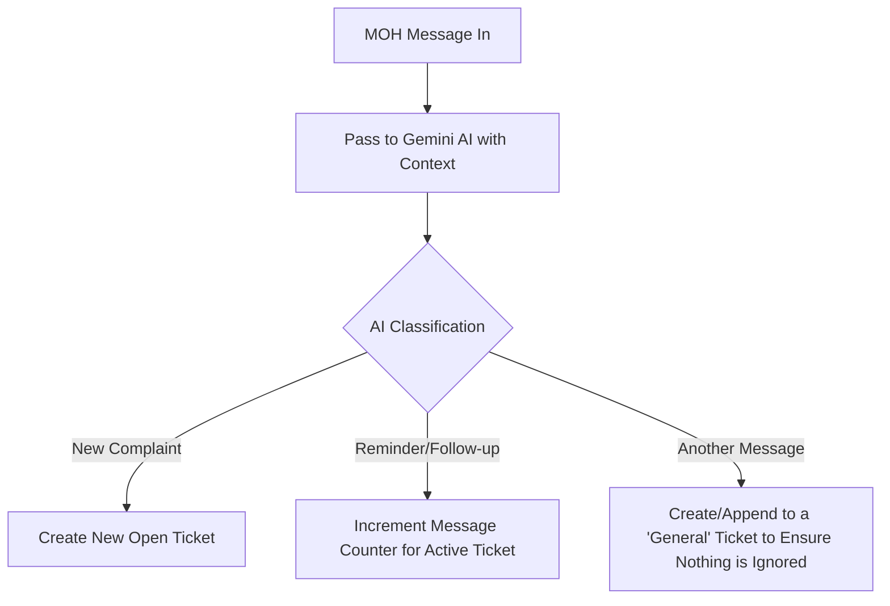

# Structured Plan - MOH Complaints Monitoring and Tracking System

This document outlines a revised, highly structured design for detecting, counting, and monitoring Ministry of Health (MOH) complaints. It addresses the limitations of simple attachment tracking by moving to a **Ticket-Based Complaint Tracking System**.

---

## The Core Problem with Simple Attachment Tracking
- **False Closures**: If the clinic sends a brochure, directions map, or invoice PDF, it would be misclassified as a "complaint closure attachment".
- **Concurrent Complaints**: An MOH sender might handle multiple complaints at the same time. Grouping purely by phone number makes it impossible to track separate message counters for different complaints in the same chat.
- **Ambiguity**: Text-only messages sent right after a ticket closure might be misidentified as a new complaint when they are actually just greetings or follow-ups.

---

## Revised System Architecture: AI-Driven Ticket Tracking

We will restructure the database and tracking rules to treat each complaint as a **distinct Ticket**, and use **Gemini AI** to read every message and classify it autonomously.



### 1. Database Schema (`complaints_cache.json`)
Each complaint/interaction is recorded as a structured ticket:
```json
{
  "ticketId": "MOH-123456",          // Explicit MOH Ticket number or AI-generated ID
  "senderPhone": "966505190413",
  "senderName": "وزارة الصحة",
  "status": "OPEN",                  // OPEN, CLOSED
  "openDate": "2026-06-11T14:30:00.000Z",
  "closeDate": null,
  "messageCount": 3,                 // Number of incoming MOH messages (reminders/complaints)
  "closureAttachmentSent": false,    // Whether clinic sent a file to close this ticket
  "messages": [
    {
      "timestamp": "2026-06-11T14:30:00.000Z",
      "text": "بلاغ رقم 123456: مريض يشتكي...",
      "classification": "NEW_COMPLAINT", // COMPLAINT, REMINDER, OTHER
      "fromMe": false,
      "hasAttachment": true
    }
  ]
}
```

---

## Strict Rules for State Transition & AI Classification

### A. The AI Decision Engine
Every incoming message from the MOH is passed to the Gemini AI model along with the current open tickets for that sender. The AI reads the content and returns a classification:

1. **New Complaint (CREATE)**: If the MOH is opening a new case (e.g. explicitly says "بلاغ رقم X" or the AI detects a new issue). The system creates a new **Open Ticket**.
2. **Reminder (INCREMENT)**: If the MOH is sending a reminder, follow-up, or asking for an update on an existing open ticket. The AI identifies which active ticket it belongs to, and increments its counter.
3. **Another Message (OTHER)**: If the message is a greeting, general inquiry, or something else. Because **nothing should be ignored**, the AI will still log it. If it doesn't belong to a specific open ticket, a temporary ticket is created so the interaction is tracked and visible on the dashboard.
4. **Direct Attachment from MOH (FILE/IMAGE)**: If the MOH directly sends a file or an image, the AI will immediately capture it. If the attachment is related to an active ticket, it increments the counter. If there are no active tickets or it represents a new issue, a **New Open Ticket** is created instantly, ensuring no documents or proofs from the MOH are ever missed.

### B. Closing a Complaint
A ticket is closed in three structured ways:
1. **Outgoing Attachment Match**: The clinic sends an attachment to the MOH contact. If there is an active open ticket for that chat, the AI will evaluate if this is a closure.
2. **Explicit Admin Command**: Admin replies with `/close <TicketNo>` (e.g., `/close 123456`) or `/close` in the chat.
3. **Web Dashboard Resolution**: The staff clicks "Resolve Complaint" on the `/complaints` dashboard.

---

## Detailed Action Plan

1. **Refactor whatsapp.js**:
   - Change `complaintsStore` from phone-indexed to `ticketId`-indexed.
   - Implement regex ticket extractor `extractTicketId(text)`.
   - Update `messages.upsert` to enforce the state machine above.
   - Improve log streams.
2. **Upgrade Dashboard (`src/complaints.html`)**:
   - Show metrics per ticket.
   - Include a ticket search filter.
   - Display a list of open and closed tickets. Clicking a ticket shows only the messages associated with that specific ticket ID.
3. **Admin Alerts**:
   - Alerts sent to admins will clearly state the Ticket ID and current message count (e.g. `الرسالة رقم 3 لبطاقة بلاغ رقم 123456`).
