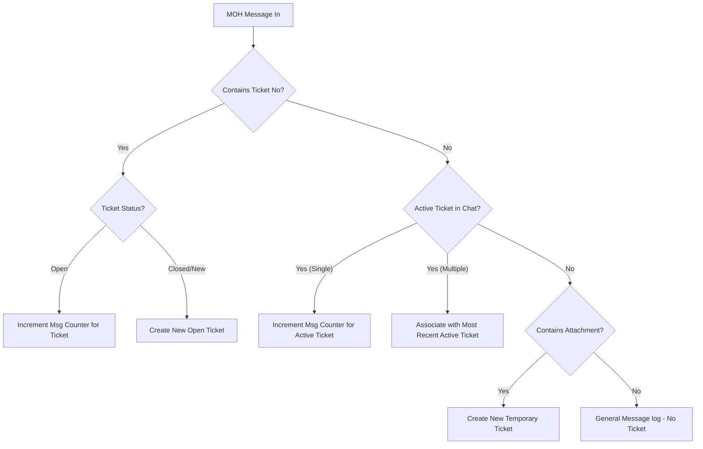

# Structured Plan - MOH Complaints Monitoring and Tracking System

This document outlines a revised, highly structured design for detecting, counting, and monitoring Ministry of Health (MOH) complaints. It addresses the limitations of simple attachment tracking by moving to a **Ticket-Based Complaint Tracking System**.

---

## The Core Problem with Simple Attachment Tracking
- **False Closures**: If the clinic sends a brochure, directions map, or invoice PDF, it would be misclassified as a "complaint closure attachment".
- **Concurrent Complaints**: An MOH sender might handle multiple complaints at the same time. Grouping purely by phone number makes it impossible to track separate message counters for different complaints in the same chat.
- **Ambiguity**: Text-only messages sent right after a ticket closure might be misidentified as a new complaint when they are actually just greetings or follow-ups.

---

## Revised System Architecture: Ticket-Based Tracking

We will restructure the database and tracking rules to treat each complaint as a **distinct Ticket**.



### 1. Database Schema (`complaints_cache.json`)
Each complaint is recorded as a structured ticket:
```json
{
  "ticketId": "MOH-123456",          // Explicit MOH Ticket number or generated ID (e.g. TEMP-96650-1718114)
  "senderPhone": "966505190413",
  "senderName": "وزارة الصحة",
  "status": "OPEN",                  // OPEN, CLOSED
  "openDate": "2026-06-11T14:30:00.000Z",
  "closeDate": null,
  "messageCount": 3,                 // Number of incoming MOH messages for this ticket
  "closureAttachmentSent": false,    // Whether clinic sent a file to close this ticket
  "messages": [
    {
      "timestamp": "2026-06-11T14:30:00.000Z",
      "text": "بلاغ رقم 123456: مريض يشتكي...",
      "fromMe": false,
      "hasAttachment": true
    }
  ]
}
```

---

## Strict Rules for State Transition & Counter Detection

### A. Detecting a New Complaint (Opening)
A complaint is opened under two conditions:
1. **Explicit Ticket Detection**: Any message from MOH containing a ticket regex match (e.g. `بلاغ\s*رقم\s*(\d+)` or `شكوى\s*رقم\s*(\d+)`). If that Ticket ID does not exist or is currently closed, a new **Open Ticket** is created.
2. **Implicit Attachment Detection**: If the message has an attachment but no explicit ticket number is found:
   - If there is no open ticket in the chat, the system opens a new ticket with a temporary ID (e.g., `TEMP-[phone]-[timestamp]`).

### B. Message Counting (Monitoring)
Every new message from MOH is matched to a ticket:
1. If the message explicitly mentions an open Ticket ID (e.g., `123456`), we increment that ticket's counter.
2. If the message has no Ticket ID, but there is exactly **one** open ticket for this sender, we increment that active ticket's counter.
3. If no ticket is open and no attachment is present, the message is logged as general chat history and does not increment any complaint counter.

### C. Closing a Complaint
A ticket is closed in three structured ways:
1. **Outgoing Attachment Match**: The clinic sends an attachment to the MOH contact. If there is an active open ticket for that chat, it is marked as closed.
2. **Explicit Admin Command**: Admin replies with `/close <TicketNo>` (e.g., `/close 123456`) or `/close` in the chat.
3. **Web Dashboard Resolution**: The staff clicks "Resolve Complaint" on the `/complaints` dashboard.

---

## Detailed Action Plan

1. **Refactor whatsapp.js**:
   - Change `complaintsStore` from phone-indexed to `ticketId`-indexed.
   - Implement regex ticket extractor `extractTicketId(text)`.
   - Update `messages.upsert` to enforce the state machine above.
   - Improve log streams.
2. **Upgrade Dashboard (`src/complaints.html`)**:
   - Show metrics per ticket.
   - Include a ticket search filter.
   - Display a list of open and closed tickets. Clicking a ticket shows only the messages associated with that specific ticket ID.
3. **Admin Alerts**:
   - Alerts sent to admins will clearly state the Ticket ID and current message count (e.g. `الرسالة رقم 3 لبطاقة بلاغ رقم 123456`).
