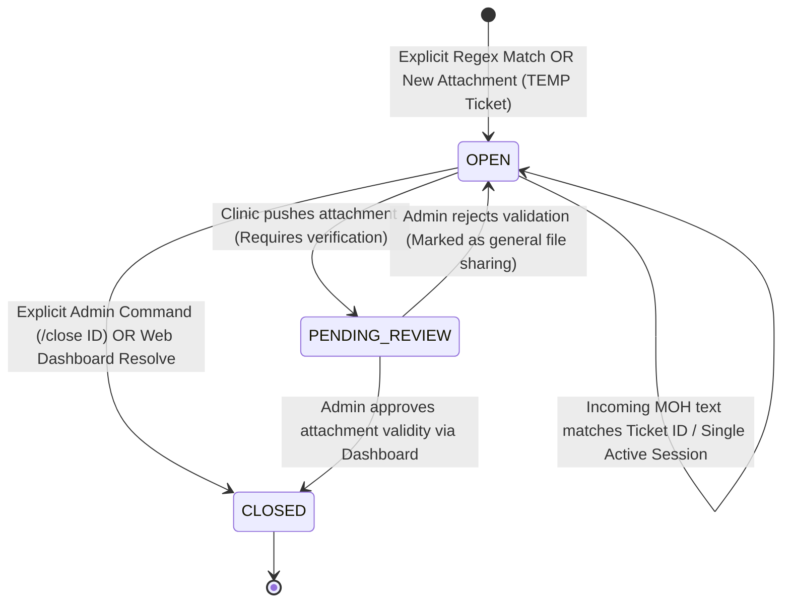
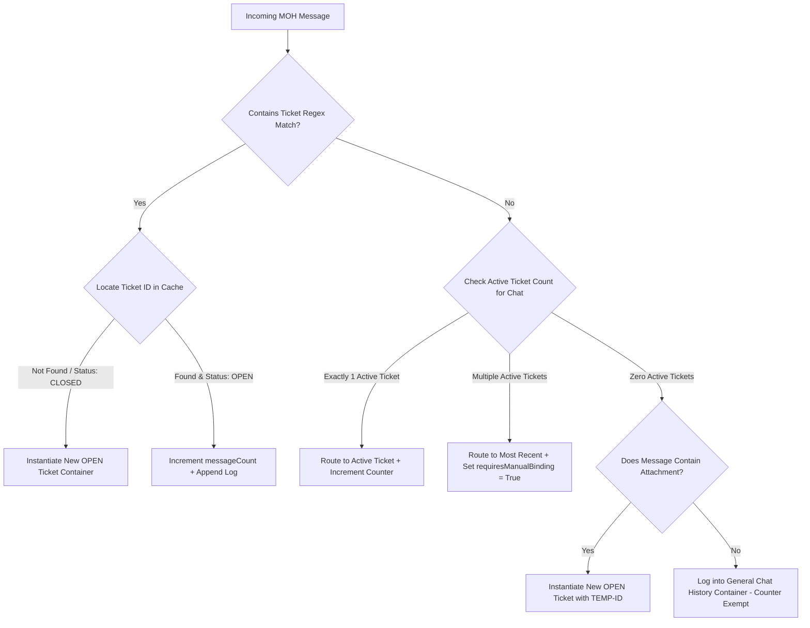

# Upgraded Structured Plan: MOH Complaints Monitoring and Tracking System (v2)

This document outlines the hardened, production-ready architectural design for detecting, tracking, and auditing Ministry of Health (MOH) complaints. It upgrades the initial `implementation_plan.md` framework by resolving critical logical vulnerabilities regarding automated ticket closures, multi-ticket message collisions, and asynchronous state mapping.

---

## 1. Executive Summary & Core Vulnerability Fixes

The transition from basic phone-number or attachment tracking to a **Ticket-Based Complaint Tracking System** is required to meet healthcare regulatory audit compliance. However, naive automated tracking introduces data corruption loops. This updated plan directly patches the following system vulnerabilities identified in previous iterations:

### A. Resolution of the "False Closure" Paradox
* **The Vulnerability:** Initial iterations dictated that if a clinic sends an attachment to an MOH contact while a ticket is open, the system auto-closes that ticket. In reality, clinics frequently send non-closure attachments (e.g., medical brochures, direction maps, invoices, or preliminary inquiries), leading to premature false closures of open regulatory complaints.
* **The Production Fix:** The system eliminates auto-closure on arbitrary attachments. Instead, an outgoing attachment triggers a transition to a `PENDING_REVIEW` state. The ticket remains structurally open and continues tracking incoming traffic until an admin manually verifies the resolution on the dashboard or issues an explicit text-based command.

### B. Elimination of Multi-Ticket Ambiguity Collisions
* **The Vulnerability:** When an institutional MOH sender handles multiple complaints concurrently within a single WhatsApp chat layer, messages without an explicit ticket number create routing ambiguity. Defaulting to associate these messages with the "most recent active ticket" results in cross-contamination of independent compliance audits.
* **The Production Fix:** Unnumbered incoming messages in a multi-ticket chat are flagged with a strict `requiresManualBinding: true` state attribute. The counter safely increments, but the system visually segregates the interaction on the administration web layout, preventing unverified data associations from contaminating compliance histories.

### C. True Counter Isolation
* **The Production Fix:** The indexing layer shifts entirely from a flat phone-string indexing model to a unique `ticketId`-indexed array structure. This allows concurrent message loops, independent temporary states, and atomic counters to run simultaneously inside the same text interaction environment.

---

## 2. Refined System Architecture & Lifecycle

Every compliance case passes through an explicit state machine designed to prevent dropped frames, missing counters, or orphaned interactions.



### Routing and Parsing Logic Flowchart



---

## 3. Hardened Production Database Schema (`complaints_cache.json`)

The caching data model supports asynchronous validation, deep auditing, and dashboard rendering elements:

```json
[
  {
    "ticketId": "MOH-874921",
    "senderPhone": "966505190413",
    "senderName": "وزارة الصحة",
    "status": "OPEN",
    "isTemporary": false,
    "requiresManualBinding": false,
    "openDate": "2026-06-11T12:00:00.000Z",
    "closeDate": null,
    "messageCount": 3,
    "messages": [
      {
        "timestamp": "2026-06-11T12:00:00.000Z",
        "text": "بلاغ رقم 874921: شكوى بخصوص فترات الانتظار بمقر العيادة الرئيسي",
        "fromMe": false,
        "hasAttachment": false
      },
      {
        "timestamp": "2026-06-11T12:15:00.000Z",
        "text": "برجاء موافاتنا بإفادة رسمية خلال ٢٤ ساعة.",
        "fromMe": false,
        "hasAttachment": false
      }
    ]
  },
  {
    "ticketId": "TEMP-966505190413-1765829100",
    "senderPhone": "966505190413",
    "senderName": "وزارة الصحة",
    "status": "PENDING_REVIEW",
    "isTemporary": true,
    "requiresManualBinding": true,
    "openDate": "2026-06-11T13:30:00.000Z",
    "closeDate": null,
    "messageCount": 1,
    "messages": [
      {
        "timestamp": "2026-06-11T13:30:00.000Z",
        "text": "[⚠️ AMBIGUOUS MATCH] ملف الشكوى الإضافي المرفق طيه",
        "fromMe": false,
        "hasAttachment": true
      }
    ]
  }
]
```

---

## 4. Code Implementation Strategy (`whatsapp.js`)

This implementation architecture is built specifically for integration inside Baileys `messages.upsert` hooks.

### A. Regex Parsing Utilities
```javascript
// Strict extraction rules for official ministerial prefix patterns
const ticketRegex = /(?:بلاغ\s*رقم\s*|شكوى\s*رقم\s*|رقم\s*البلاغ\s*)(\d+)/i;

function extractTicketId(text) {
    if (!text) return null;
    const match = text.match(ticketRegex);
    return match ? `MOH-${match[1]}` : null;
}

function generateTempId(phone) {
    return `TEMP-${phone}-${Math.floor(Date.now() / 1000)}`;
}
```

### B. Stateful Message Interceptor Hook
```javascript
async function processMOHMessagePipeline(store, m, sock) {
    const msg = m.messages[0];
    if (!msg.message) return;

    const remoteJid = msg.key.remoteJid;
    const phone = remoteJid.split('@')[0];
    const fromMe = msg.key.fromMe;
    
    // Abstract text payload parsing across multi-media types natively
    const text = msg.message.conversation || 
                 msg.message.extendedTextMessage?.text || 
                 msg.message.imageMessage?.caption || 
                 msg.message.documentMessage?.caption || "";
                 
    const hasAttachment = !!(msg.message.imageMessage || 
                             msg.message.documentMessage || 
                             msg.message.audioMessage || 
                             msg.message.videoMessage);

    let complaints = loadComplaintsCache(); // Utility reading complaints_cache.json

    // ----------------------------------------------------
    // PIPELINE OUTBOUND: CLINIC RESPONDING TO CHAT
    // ----------------------------------------------------
    if (fromMe) {
        if (text.startsWith('/close')) {
            const commandTarget = text.split(' ')[1];
            executeTicketClosure(complaints, commandTarget, phone, remoteJid, sock);
            return;
        }

        if (hasAttachment) {
            const openTickets = complaints.filter(t => t.senderPhone === phone && t.status === 'OPEN');
            if (openTickets.length === 1) {
                // Intercept logic: Shift state to block premature auto-closure loops
                openTickets[0].status = "PENDING_REVIEW";
                openTickets[0].messages.push({
                    timestamp: new Date().toISOString(),
                    text: "[Clinic Outbound Attachment Pushed - Under Validation]",
                    fromMe: true,
                    hasAttachment: true
                });
                saveComplaintsCache(complaints);
                await sock.sendMessage(remoteJid, { 
                    text: `⚠️ تم استلام الملف المرفق. تم تحويل بطاقة الشكوى ${openTickets[0].ticketId} إلى مرحلة المراجعة للتأكد من مطابقة شروط الإغلاق المعتمدة.` 
                });
            }
        }
        return;
    }

    // ----------------------------------------------------
    // PIPELINE INBOUND: MINISTERIAL AGENT RAW TRAFFIC
    // ----------------------------------------------------
    const explicitTicketId = extractTicketId(text);
    const activeTickets = complaints.filter(t => t.senderPhone === phone && t.status === 'OPEN');

    if (explicitTicketId) {
        let ticket = complaints.find(t => t.ticketId === explicitTicketId);

        if (!ticket || ticket.status === 'CLOSED') {
            // Re-instantiate or initiate clean ledger row
            ticket = {
                ticketId: explicitTicketId,
                senderPhone: phone,
                senderName: msg.pushName || "وزارة الصحة",
                status: "OPEN",
                isTemporary: false,
                requiresManualBinding: false,
                openDate: new Date().toISOString(),
                closeDate: null,
                messageCount: 1,
                messages: [{ timestamp: new Date().toISOString(), text, fromMe: false, hasAttachment }]
            };
            complaints.push(ticket);
            await triggerAdminAlert(sock, `🚨 بلاغ رسمي جديد وارد من وزارة الصحة رقم: ${explicitTicketId}`);
        } else {
            // Safe increment on existing track matching identification tags
            ticket.messageCount += 1;
            ticket.messages.push({ timestamp: new Date().toISOString(), text, fromMe: false, hasAttachment });
            await triggerAdminAlert(sock, `💬 الرسالة رقم ${ticket.messageCount} لبطاقة البلاغ النشطة رقم ${ticket.ticketId}`);
        }
    } else {
        // Evaluate Implicit / Ambiguous State Branches
        if (activeTickets.length === 1) {
            // Clean unnumbered contextual response matching exact context frame
            activeTickets[0].messageCount += 1;
            activeTickets[0].messages.push({ timestamp: new Date().toISOString(), text, fromMe: false, hasAttachment });
            await triggerAdminAlert(sock, `💬 رسالة الحاقية: الرسالة رقم ${activeTickets[0].messageCount} لبطاقة البلاغ رقم ${activeTickets[0].ticketId}`);
        } else if (activeTickets.length > 1) {
            // Trigger Multi-Ticket Collision Protocol
            const chronologicalTarget = activeTickets.sort((a, b) => new Date(b.openDate) - new Date(a.openDate))[0];
            chronologicalTarget.messageCount += 1;
            chronologicalTarget.requiresManualBinding = true; // Inject frontend alert flag
            chronologicalTarget.messages.push({
                timestamp: new Date().toISOString(),
                text: `[⚠️ AMBIGUOUS CONTEXTUAL MATCH] ${text}`,
                fromMe: false,
                hasAttachment
            });
            await triggerAdminAlert(sock, `⚠️ تنبيه: رسالة مبهمة واردة في محادثة تحتوي على أكثر من بلاغ نشط. تم تعليمها للمراجعة اليدوية.`);
        } else {
            // Context contains zero active items
            if (hasAttachment) {
                const tempId = generateTempId(phone);
                const newTempTicket = {
                    ticketId: tempId,
                    senderPhone: phone,
                    senderName: msg.pushName || "وزارة الصحة",
                    status: "OPEN",
                    isTemporary: true,
                    requiresManualBinding: false,
                    openDate: new Date().toISOString(),
                    closeDate: null,
                    messageCount: 1,
                    messages: [{ timestamp: new Date().toISOString(), text, fromMe: false, hasAttachment }]
                };
                complaints.push(newTempTicket);
                await triggerAdminAlert(sock, `⚠️ تم فتح ملف بلاغ مؤقت رقم ${tempId} نظراً لاستلام ملف مرفق مستقل بدون رقم مرجعي.`);
            } else {
                // Completely safe operational history capture pipeline bypass
                appendGeneralInteractionLog(phone, text);
            }
        }
    }

    saveComplaintsCache(complaints);
}
```

---

## 5. Web Interface Specifications (`src/complaints.html`)

To visualize this upgraded tracking layer, the dashboard UI layout must present actionable state management features:

1. **State-Adaptive Color Controls:**
   * `OPEN` $
ightarrow$ Deep Crimson (`#DC2626`) with pulsing indicators to show tracking priority.
   * `PENDING_REVIEW` $
ightarrow$ Amber Alert (`#D97706`), locking the entry line until an admin approves or rejects the closure file validation check.
   * `CLOSED` $
ightarrow$ Neutral Slate Green (`#059669`) capturing archived elements natively.
2. **Ambiguity Resolution Component:**
   * Rows containing `requiresManualBinding: true` must display a cautionary border alert.
   * Clicking the warning triggers an interactive split-pane interface allowing administrative staff to highlight specific messages and split or merge them into a different existing `ticketId` map.
3. **Temporary Promotion Portal:**
   * Provides an explicit manual toggle field next to `TEMP-` prefixed ticket rows labeled *"Promote to Official MOH ID"*. Clicking it replaces the temporal hash key with a real verified input string while keeping historical data intact.
